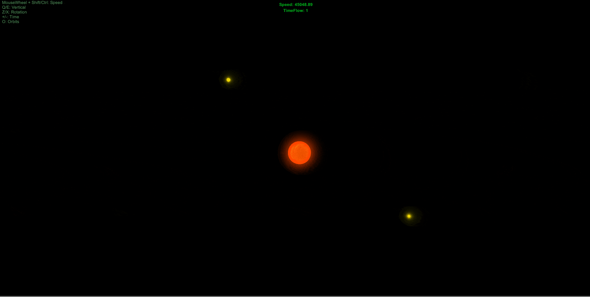

# Procedural Space

> Procedural stars, planets, and systems generation for Unity.

## :dizzy: Orbiting

> Planets can orbit stars while moons orbit planets.

## :earth_americas: Runtime Level Editor

> Impelented procedural planet generation without using quadtree.

## :clipboard: Meta

Spartak Gevorgyan – artak10t@gmail.com

Distributed under the GNU General Public License v3.0 license. See ``GNU General Public License v3.0`` for more information.

[https://github.com/artak10t/github-link](https://github.com/artak10t/)
